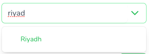
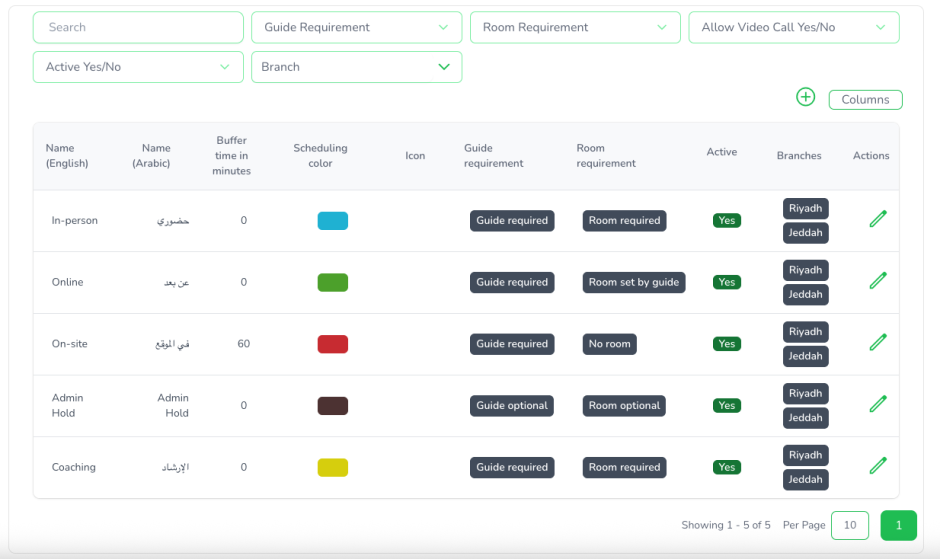
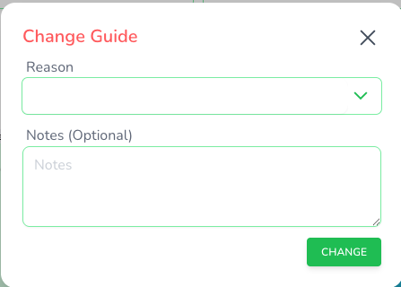
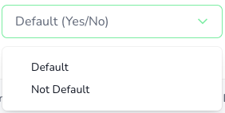
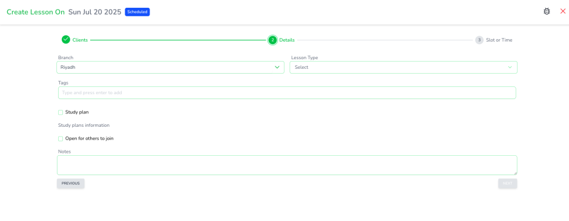
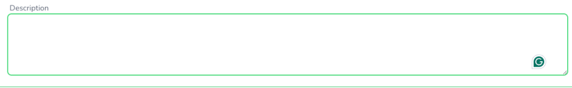

# Reusable Vue components, from buttons to a countdown timer, crafted with love

## Based on Vue 3, composition API

Dusk, Tailwind CSS and Inertia.js are assumed

---

## 📸 Screenshots

### Autocomplete

### Data Table

### Modal Dialog

### Pill Component

### Select Input

### Stepper

### Textarea Input

